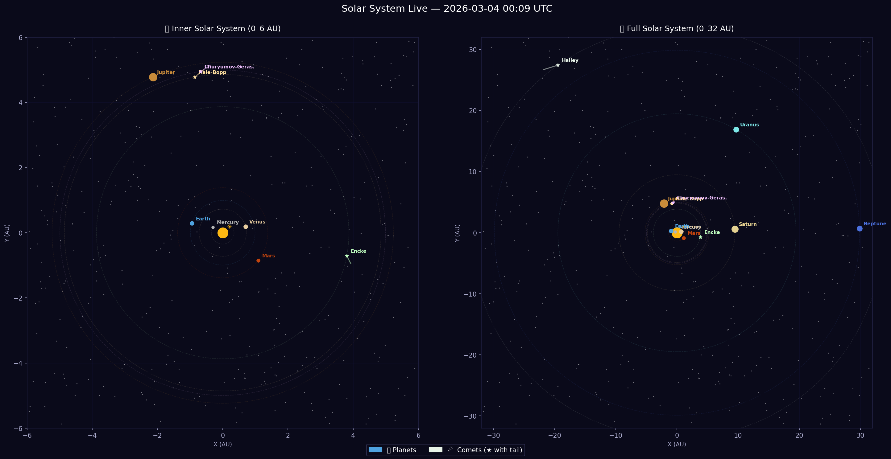

# Solar System Live Tracker

A real-time data pipeline that pulls live planetary and comet positions from 
NASA's Horizons API, streams them through AWS, and visualizes them on an 
interactive dashboard.

Check it out here! https://projectplanets.streamlit.app/

I also created a Tableau Public dashboard you can check out here! https://public.tableau.com/app/profile/luc.nguyen6635/viz/planets_17726414911280/Dashboard1?publish=yes



---

## What It Does

Every 10 minutes, this pipeline:
1. Queries **NASA Horizons API** for positions of 8 planets + 4 comets
2. Streams data through **AWS Kinesis**
3. Processes + enriches it with **AWS Lambda**
4. Stores snapshots in **AWS S3**
5. Makes it queryable via **AWS Athena**
6. Displays it live on a **Streamlit dashboard**

---

## 🛠️ Tech Stack

| Layer | Technology |
|-------|-----------|
| Data Source | NASA JPL Horizons API |
| Ingestion | AWS Kinesis |
| Processing | AWS Lambda (Python 3.11) |
| Storage | AWS S3 |
| Query | AWS Athena (SQL) |
| Automation | AWS EventBridge (every 10 min) |
| Dashboard | Streamlit + Plotly |
| Language | Python |

---

## Dashboard Features

- **Live Orrery** — real orbital paths with current positions overlaid
- **Speed Leaderboard** — see Mercury blazing at 52 km/s vs Halley crawling at 0.9 km/s
- **Light Travel Time** — how long light takes to reach each object right now
- **Stats Table** — distance, speed, longitude for all tracked objects
- **Auto-refresh** — data updates every 10 minutes automatically

---

## 🪐 Tracked Objects

**Planets:** Mercury, Venus, Earth, Mars, Jupiter, Saturn, Uranus, Neptune

**Comets:** Halley's Comet, Hale-Bopp, Churyumov-Gerasimenko, Encke

---

## 🏗️ Architecture
```
NASA Horizons API
      ↓
pipeline Lambda (every 10 min via EventBridge)
      ↓
AWS Kinesis Stream
      ↓
processor Lambda (auto-triggered)
      ↓
AWS S3
  ├── raw/YYYY/MM/DD/HHMM/snapshot.json
  └── processed/planet|comet/name/timestamp.json
      ↓
AWS Athena (SQL)
      ↓
Streamlit Dashboard
```

---

## 📡 Data Source

All positional data comes from **NASA JPL Horizons** — 

---

## 📝 License

MIT License — free to use, modify, and share.

---
